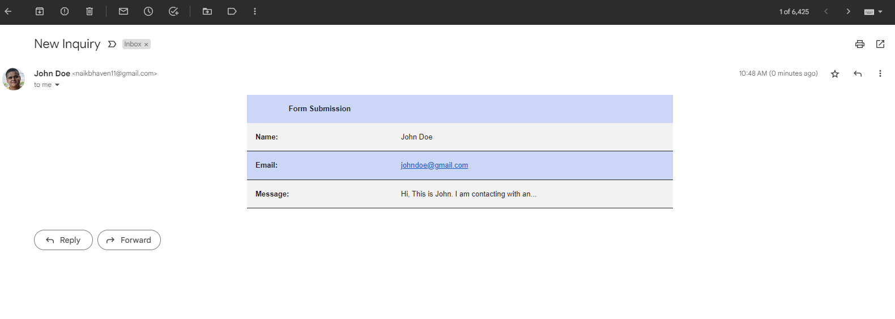

# Full Stack Contact Form

## About The Project

This repository contains a simple Full-Stack Contact Form. The aim of the project is to create a contact form that can be integrated into any portfolio or website. The app uses ReactJS for the frontend, it's designed using Material-UI, and uses ExpressJS for the backend server. The frontend project files have been created using `npx create-react-app`. The backend project files have been created using `npx express-generator`. Some cleanup has been done to the folder structures.

### Built With

- [](https://reactjs.org/)
- [](https://mui.com/)
- [](https://expressjs.com/)

## Getting Started

### Prerequisites

- npm
  ```javascript
  npm install npm@latest -g
  ```

### Installation

1. Clone the repo

   ```javascript
   git clone https://github.com/bhaven123/contact-form-with-backend.git
   ```

2. Install NPM packages

   ```javascript
   npm install
   ```

## Usage

### Screenshots

1. Frontend UI


2. Submission Modal

   

3. Email Response

   

4. Server Response

   

## Contact

Bhaven Naik - [naikbhaven11@gmail.com](mailto:naikbhaven11@gmail.com)

Project Link: [https://github.com/bhaven123/contact-form-with-backend](https://github.com/bhaven123/contact-form-with-backend)

## Acknowledgments

- [Material-UI](https://mui.com/)
- [Create a New React App](https://reactjs.org/docs/create-a-new-react-app.html)
- [Express Generator](https://expressjs.com/en/starter/generator.html)
